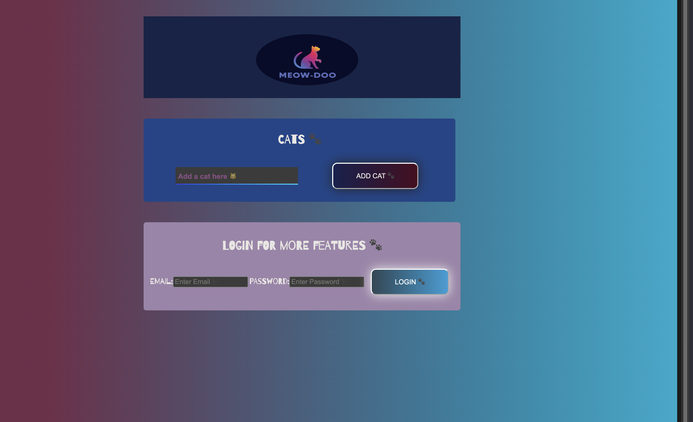

# MEOW-DOO ฅ^•ﻌ•^ฅ

*Meow-Doo* is a not-so-serious MERN application built for testing purposes; the documentation on how to run the tests can be found [can be found here](./documentation/documentation.md). 

*Meow-Doo* is based on a previous project, [Space Cats](https://github.com/HedonisticOpportunist/Space-Cats).

