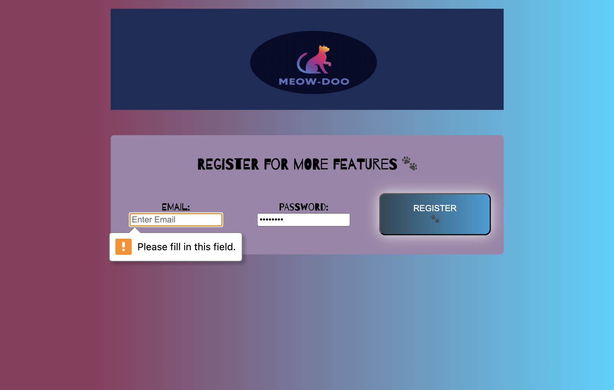
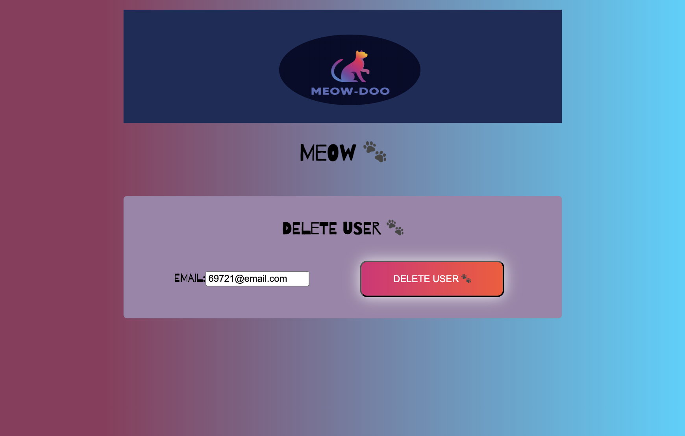
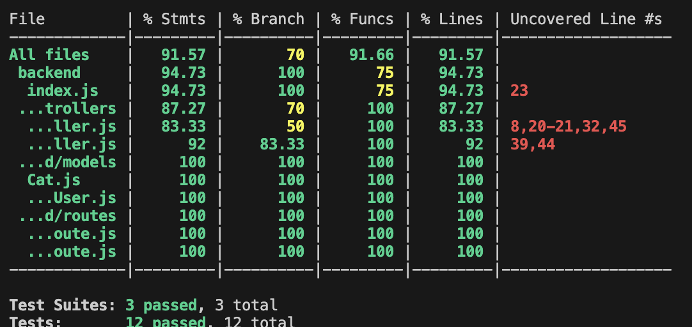

# TEST PLAN AND DOCUMENTATION

## **AREAS TESTED**

#### FRONTEND

The `frontend` tests deal with the following functionality:

- Verifying the CRUD functionality of the cat items, i.e., adding a cat item, deleting a cat item, and modifying one.
- Checking the login process, such as logging in without entering an email or password. Happy paths, such as a user logging in with valid credentials, are also part of the test suite.
- Checking the registration process, such as registering without entering an email or password. Happy paths, such as a user logging in with valid credentials, are also part of the test suite.

#### BACKEND

The `backend` tests deal with the following functionality:

- Making calls related to cat items, such as getting all items or adding a new one.
- Making calls related to the user, such as logging in or registration.
- In both cases, happy and unhappy testing paths form part of the test suite.
- Checking that the server connects and disconnects from the database.
- Checking that the server correctly calls its main entry point.

## **TEST COVERAGE AREAS**

#### FRONTEND

The `frontend` testing focuses, though encompassing and communicating with the `backend`, on the following elements:

- The way the App.jsx file communicates with the pages in the `pages` folder.
- The way the pages in the `pages` folder communicate with the forms in the `components` folder.
- The way actions triggered by the user on the forms, via input or button clicks, cause them to communicate with the functions in the `services` folder.

#### BACKEND

The `backend` testing focuses on the following elements:

- The `cat` and `registeredUser` models that decide how these data items are structured.
- The `routes` and `controllers` that determine what happens in case of a user action.
- The server and database connections.

The code coverage for the `backend` is as follows:

## **TOOLS USED AND WHY**

#### FRONTEND

The `frontend` project uses [Cypress](https://www.cypress.io) for end-to-end testing. The reason for using this tool lies in its hassle-free setup.

#### BACKEND

The `backend` project uses [Jest with supertest](https://medium.com/@it.ermias.asmare/node-js-express-with-jest-and-supertest-e58aaf4c4514) for API testing. The reason for using this tool is its similarity to [Cypress](https://docs.cypress.io/app/get-started/why-cypress) in terms of syntax and the equally simple setup.

## **HOW TO RUN THE TESTS**

Please note that **both** services must be operational.

#### FRONTEND

- Navigate to the `frontend` folder.
- In the terminal, type and run `npm run dev` to start the frontend.
- In the terminal, type and run `npx cypress run`to run the tests in the terminal.

If you want to use a GUI:

- In the terminal, type and run `npx cypress open` to start Cypress.
- Pick a test spec to run on the Cypress GUI.

For more instructions, refer to the [Cypress documentation](https://docs.cypress.io/app/get-started/why-cypress).

#### BACKEND

- Navigate to the `backend` folder.
- In the terminal, type and run `npm run start` to start the server.
- In the terminal, type and run `npm run test` to start the tests.

## **LIMITATIONS/ASSUMPTIONS**

#### Project Limitations and Test Assumptions

The testing focuses on a web application that had a quick development process and, therefore, does not necessarily adhere to best practices. More precisely, the Cat-to-Do application is accessible to everyone, and the login process is primarily available for bonus content.

As a result, the testing for the CRUD functionality of the cat items does not take into consideration user permissions.

#### Test Limitations

Due to time constraints and a knowledge gap, the project does not use [mocking](https://javascript.plainenglish.io/write-integration-tests-and-mocks-with-jest-and-supertest-b65a7b9186ce) of the API services.
